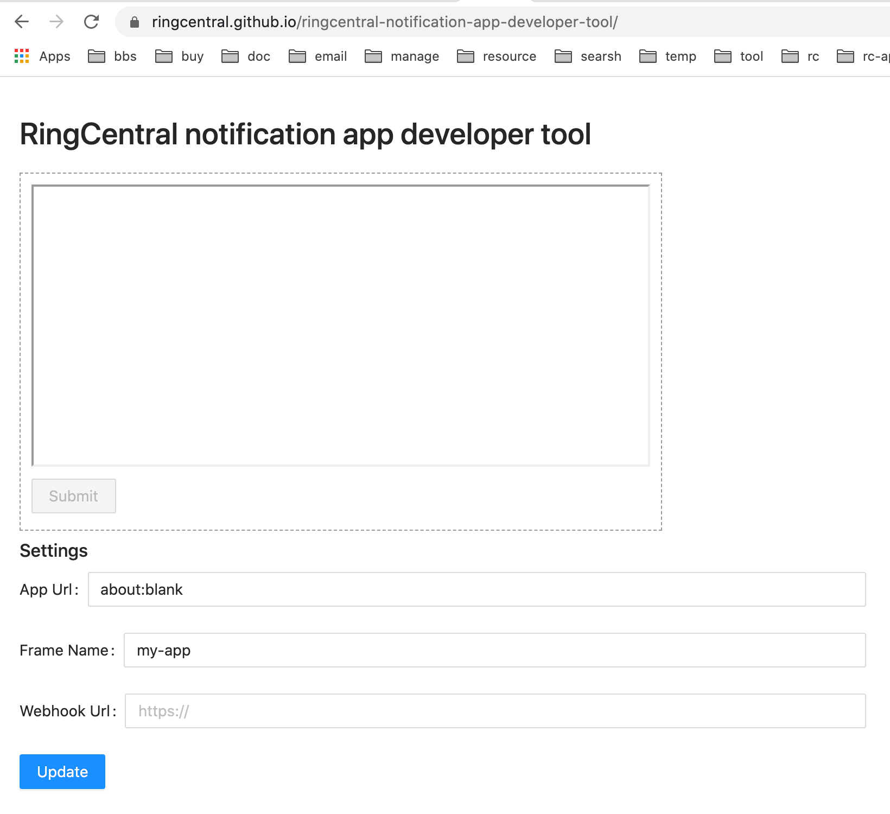

# RingCentral notification app developer tool

A tool to help developer to test notification integration for RingCentral app



## Use

Just visit [https://ringcentral.github.io/ringcentral-notification-app-developer-tool](https://ringcentral.github.io/ringcentral-notification-app-developer-tool), fill in your app url and webhook url, the app will load just as in RingCentral app.

## Dev

```sh
# install deps
npm i

# create env file and edit .env
cp sample.env .env

# start server
npm start

# start client
npm run c

# Then visit http://127.0.0.1:6067 by default
```

## build for github pages

```sh
npm run gh
```

## License

MIT
